# Agentic AI — AWS Nanodegree, Project 2

**Customer Support Agent with Amazon Bedrock AgentCore and the Strands SDK**

A single conversational agent for an e-commerce platform that tracks orders,
processes refunds, answers policy questions from a knowledge base, remembers
customers between sessions, computes loyalty discounts in a sandbox, and
browses the live web.

Five capabilities, five different AgentCore primitives, one entrypoint:

| Capability | Primitive | How |
|---|---|---|
| **Order tracking** | Gateway → API Gateway target | `get_order`, `get_customer`, `get_customer_orders` as MCP tools over a REST proxy integration |
| **Refunds and returns** | Gateway → Lambda target | `initiate_refund`, `check_refund_status`, `get_return_label`, routed by the tool name in the Lambda client context |
| **Product and policy answers** | Bedrock Knowledge Base | `search_knowledge_base` calls the Retrieve API and returns joined chunks, grounded |
| **Cross-session memory** | AgentCore Memory | a `HookProvider` that injects customer context *before* the model reads the message, and saves every completed turn |
| **Exact discount arithmetic** | Code Interpreter | the business rules are written into a program and executed with `clearContext=True` — the model never does the sums |
| **Live web pages** | AgentCore Browser | `AgentCoreBrowser(region=REGION).browser` |

---

## Architecture

```
                         agentcore invoke
                                │
                                ▼
                   ┌────────────────────────┐
                   │  BedrockAgentCoreApp   │   main.py, module level
                   │   @app.entrypoint      │   async invoke(payload)
                   └───────────┬────────────┘
                               │
              payload: prompt · customer_id · session_id
                               │
                   ┌───────────▼────────────┐
                   │   Strands Agent        │
                   │   Nova 2 Lite          │
                   │   hooks=[MemoryHook]   │
                   └───────────┬────────────┘
                               │
     ┌──────────────┬──────────┼───────────────┬────────────────┐
     ▼              ▼          ▼               ▼                ▼
┌─────────┐  ┌────────────┐ ┌──────────┐ ┌───────────┐  ┌─────────────┐
│ Gateway │  │ Knowledge  │ │  Memory  │ │   Code    │  │   Browser   │
│  (MCP)  │  │    Base    │ │          │ │Interpreter│  │             │
└────┬────┘  └─────┬──────┘ └────┬─────┘ └─────┬─────┘  └──────┬──────┘
     │             │             │             │               │
  ┌──┴──┐      Retrieve     2 namespaces   executeCode    live page
  │     │       API         per actor      clearContext    fetch
  ▼     ▼          │             │             │
┌────┐ ┌────┐  ┌───▼────┐   ┌────▼─────┐  ┌────▼─────┐
│API │ │λ   │  │OpenSea-│   │SEMANTIC  │  │ sandbox  │
│GW  │ │dir-│  │rch     │   │USER_PREF │  │ python   │
│prox│ │ect │  │Server- │   └──────────┘  └──────────┘
└─┬──┘ └─┬──┘  │less    │
  │      │     └────┬───┘
  ▼      ▼          ▼
order- refund-  product_
tracker proces- catalog
   λ    sor λ     .txt
```

The two Gateway targets are the part worth dwelling on: the same MCP surface
is fed by two genuinely different mechanisms — an API Gateway REST proxy and a
direct Lambda invocation — and the agent cannot tell them apart. Both arrive as
ordinary tools named `order-tracker___get_order` and
`refund-processor___initiate_refund`. Full write-up in
[`docs/ARCHITECTURE.md`](docs/ARCHITECTURE.md).

---

## Status

| | |
|---|---|
| Offline test suite | **99 tests, all passing** — `python -m pytest`, ~6 seconds, no AWS account |
| Six project scenarios | **7/7 passing** — `python -m scripts.run_scenarios` |
| Lambda handlers | ✅ real, unmodified code executes in every transcript |
| Discount arithmetic | ✅ the generated program is really executed, in a subprocess |
| Browser | ✅ real HTTP fetch, labelled `live-fetch` in the transcript |
| AWS deployment | ✅ deployed to Bedrock AgentCore in `us-east-1` |
| Live scenarios | **5/7 passing** — two real tool-selection failures, [analysed below](#deployed-on-aws--and-what-the-live-run-found) |
| Evidence | [`run-01`](evidence/run-01/) offline · [`run-02`](evidence/run-02/) live |

> **Two evidence runs, and they measure different things.**
> [`run-01`](evidence/run-01/) is the **offline harness**: the Lambda handlers
> and the discount program really execute, but tool *routing* is a rule-based
> planner, so it proves **the wiring is correct** and nothing about the model.
> [`run-02`](evidence/run-02/) is the **deployed agent on AWS**, which is where
> model behaviour shows up — and where two of the seven scenarios failed.
> The boundary is drawn in [`docs/TESTING.md`](docs/TESTING.md).

**Grading each rubric line against the evidence:** [`SUBMISSION.md`](SUBMISSION.md).

---

## The six scenarios

Every prompt below is verbatim from the project instructions, and every reply
is checked against that scenario's own "Expected:" line.

[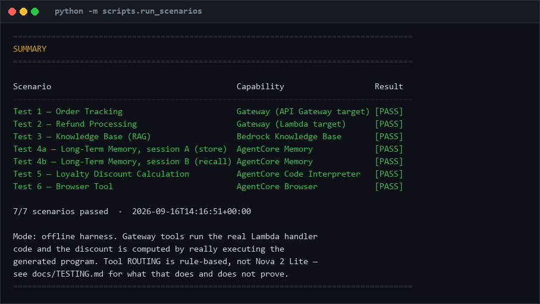](evidence/run-01/screenshots/00-run-summary.png)

<sub>🔍 [Open full size](evidence/run-01/screenshots/00-run-summary.png) &nbsp;·&nbsp; text: [`evidence/run-01/run_summary.txt`](evidence/run-01/run_summary.txt)</sub>

### Test 2 — both Gateway targets in one turn

The rubric asks for one API-based and one Lambda-based tool invocation. This
turn does both, and the ordering is the interesting part: the order is looked
up **first**, so the `$139.99` refund amount comes from the order record
rather than from the model's impression of what a Kindle costs.

[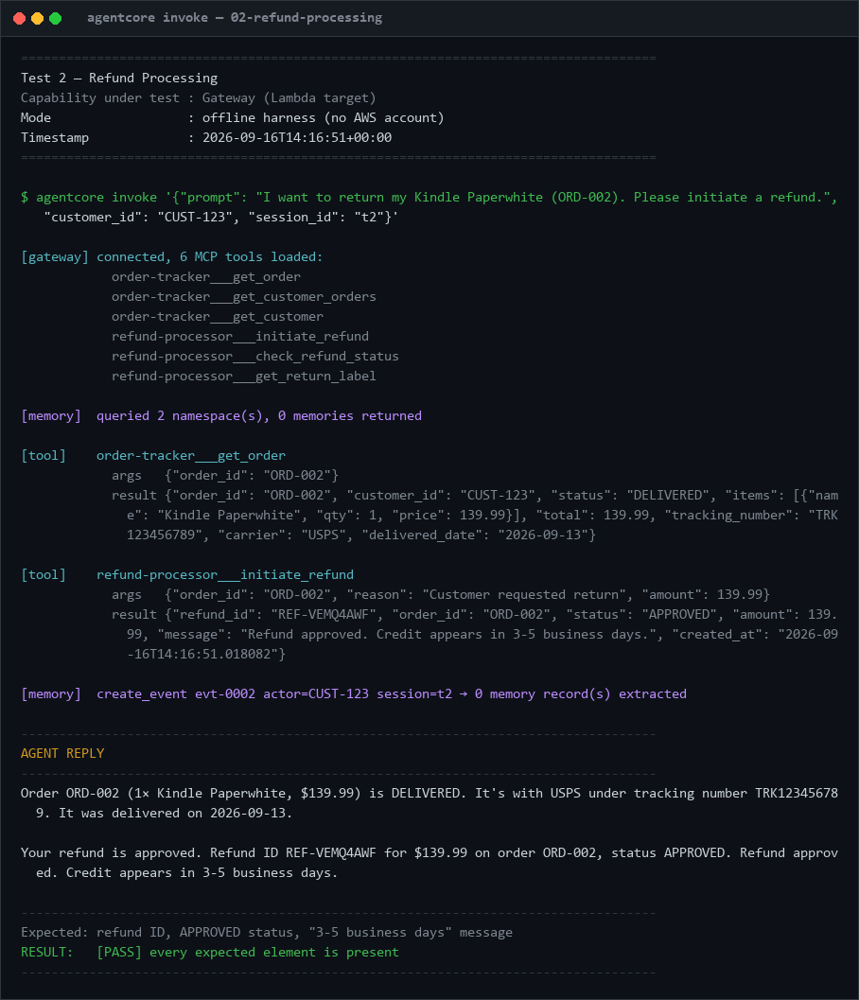](evidence/run-01/screenshots/02-refund-processing.png)

<sub>🔍 [Open full size](evidence/run-01/screenshots/02-refund-processing.png) &nbsp;·&nbsp; text: [`02-refund-processing.txt`](evidence/run-01/transcripts/02-refund-processing.txt)</sub>

### Test 5 — arithmetic the model never touches

The whole point of the Code Interpreter is that money arithmetic done by a
language model is arithmetic you cannot audit. The transcript shows the
generated program in full, then the numbers it produced.

[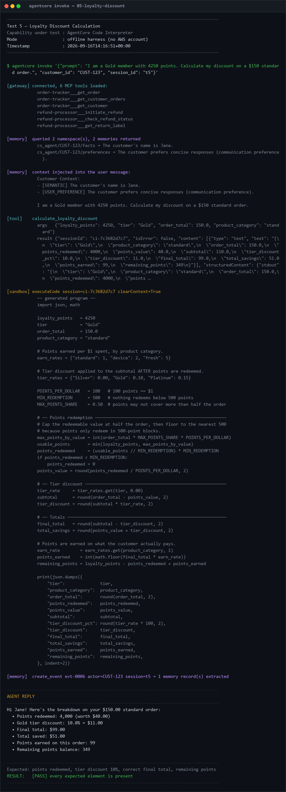](evidence/run-01/screenshots/05-loyalty-discount.png)

<sub>🔍 [Open full size](evidence/run-01/screenshots/05-loyalty-discount.png) &nbsp;·&nbsp; text: [`05-loyalty-discount.txt`](evidence/run-01/transcripts/05-loyalty-discount.txt)</sub>

Worked by hand from the catalog's rules, to check the program rather than
trust it: points cover at most half of $150, so $75 → 7,500 points; the
customer has 4,250, floored to 500-blocks → **4,000 points = $40**; subtotal
$110; Gold takes 10% of that → $11; **final $99.00**; earns 99 points back;
balance 4,250 − 4,000 + 99 = **349**. `tests/test_loyalty_discount.py` asserts
every one of those independently.

### Test 4 — memory across two sessions

Sessions `s-A` and `s-B` share a `customer_id` and nothing else. The second
transcript shows both namespaces queried, both memories returned, and the
`Customer Context:` block prepended to the message *before* the model reads it.

[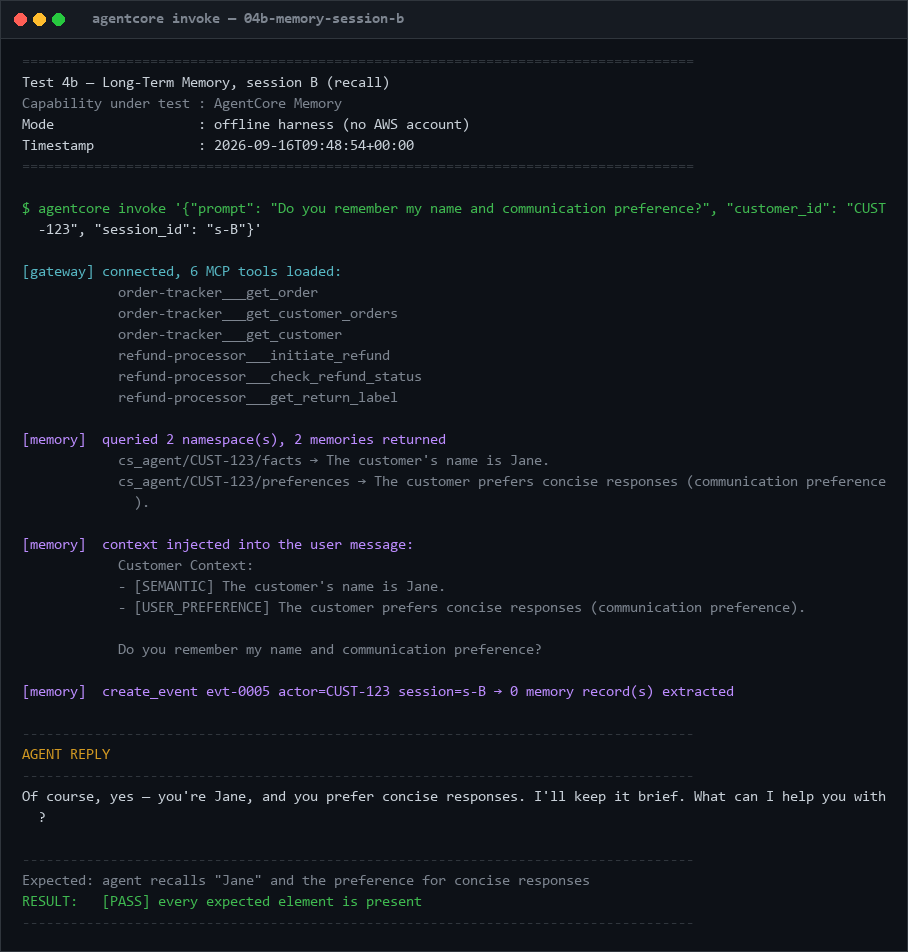](evidence/run-01/screenshots/04b-memory-session-b.png)

<sub>🔍 [Open full size](evidence/run-01/screenshots/04b-memory-session-b.png) &nbsp;·&nbsp; session A: [`04a`](evidence/run-01/transcripts/04a-memory-session-a.txt) &nbsp;·&nbsp; session B: [`04b`](evidence/run-01/transcripts/04b-memory-session-b.txt)</sub>

### Test 3 — grounded retrieval

Retrieval runs over the real `product_catalog.txt`, and the reply quotes the
retrieved chunks rather than paraphrasing them. Paraphrasing here would hide a
retrieval miss behind fluent prose.

[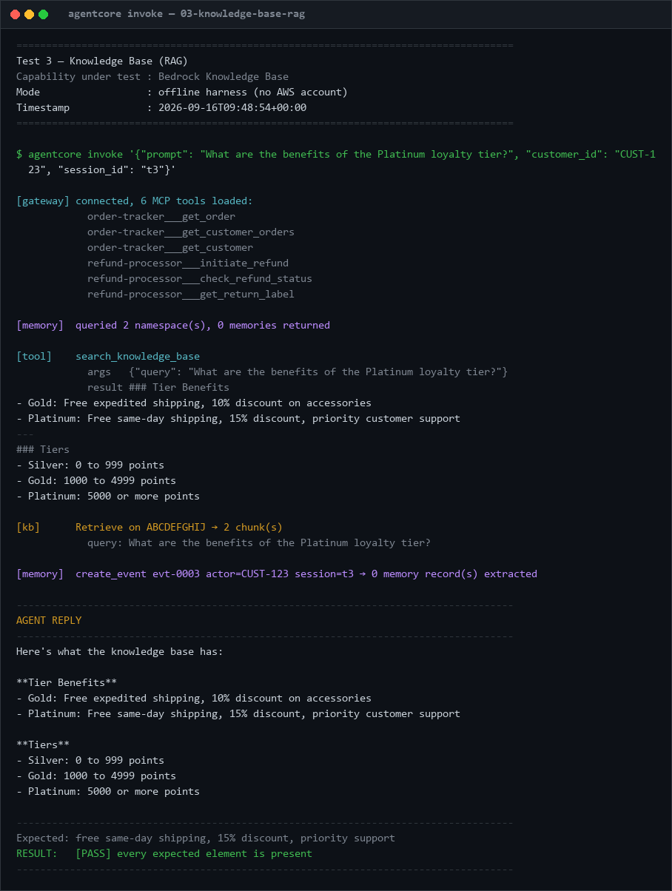](evidence/run-01/screenshots/03-knowledge-base-rag.png)

<sub>🔍 [Open full size](evidence/run-01/screenshots/03-knowledge-base-rag.png) &nbsp;·&nbsp; text: [`03-knowledge-base-rag.txt`](evidence/run-01/transcripts/03-knowledge-base-rag.txt)</sub>

### Test 1 — order tracking

[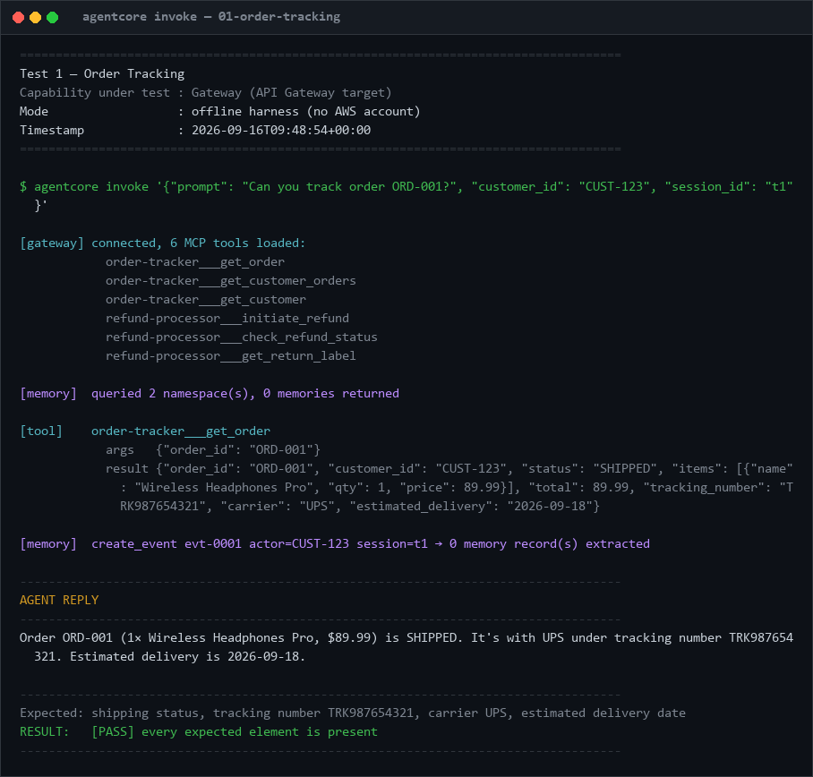](evidence/run-01/screenshots/01-order-tracking.png)

### Test 6 — the browser tool

[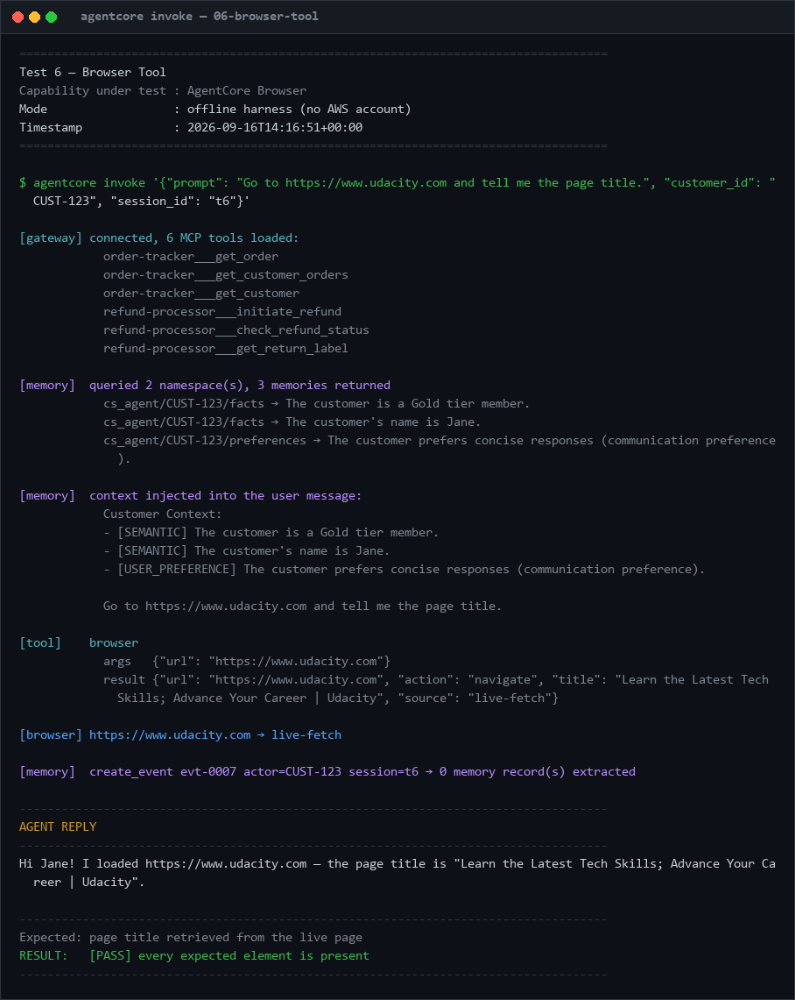](evidence/run-01/screenshots/06-browser-tool.png)

### The offline suite

[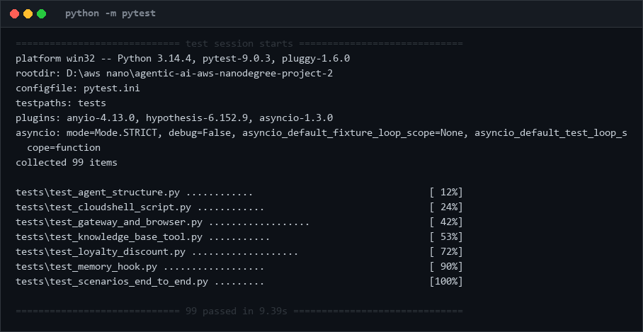](evidence/run-01/screenshots/07-offline-test-suite.png)

Full index with every artefact: [`evidence/run-01/INDEX.md`](evidence/run-01/INDEX.md).

---

## Deployed on AWS — and what the live run found

The agent was deployed to Bedrock AgentCore in `us-east-1` and the six
scenarios were run against it with `agentcore invoke`. **5 of 7 passed.**

| Scenario | Result | |
|---|---|---|
| [Knowledge Base RAG](evidence/run-02/transcripts-live/03-knowledge-base-rag.txt) | ✅ | tier benefits retrieved from the synced catalog |
| [Memory, session A](evidence/run-02/transcripts-live/04a-memory-session-a.txt) | ✅ | stores the name and preference |
| [Memory, session B](evidence/run-02/transcripts-live/04b-memory-session-b.txt) | ✅ | **cross-session recall, live** |
| [Loyalty discount](evidence/run-02/transcripts-live/05-loyalty-discount.txt) | ✅ | computed in the sandbox |
| [Browser](evidence/run-02/transcripts-live/06-browser-tool.txt) | ✅ | live page title |
| [Order tracking](evidence/run-02/transcripts-live/01-order-tracking.txt) | ❌ | answered **without calling `get_order`** |
| [Refund](evidence/run-02/transcripts-live/02-refund-processing.txt) | ❌ | approved — **for $0** |

The two failures are the most useful thing in this repository, because they are
exactly what [`docs/TESTING.md`](docs/TESTING.md) said the offline harness
could not answer, written down before the live run happened:

> *Does it look up the order total before calling `initiate_refund`, or pass a
> number it inferred from the product name?*

It does not. Asked to track `ORD-001` — a `SHIPPED` order with tracking
`TRK987654321` — Nova 2 Lite replied that it *"is being processed and is
expected to be completed in 2-3 business days"*, with no tool call at all. On
the refund it skipped the order lookup, so no amount reached the Lambda and
`event.get("amount", 0)` issued the refund for **$0**.

The wiring is right and the offline suite has asserted the correct ordering
since the first commit (`test_refund_amount_comes_from_the_order_lookup`). The
model does not reliably use it. That gap is the whole argument for running
both suites.

Full analysis: [`evidence/run-02/INDEX.md`](evidence/run-02/INDEX.md).

### Console screenshots

Captured by [`scripts/capture_console.py`](scripts/capture_console.py), which
signs a headless Chrome into the console with `sts:GetFederationToken` and
loads each page for real. A page whose content pane never painted is reported
`BLANK` and **not** committed.

**Bedrock → Knowledge Bases** — `CustomerSupportKB`, Available, 1 data source

[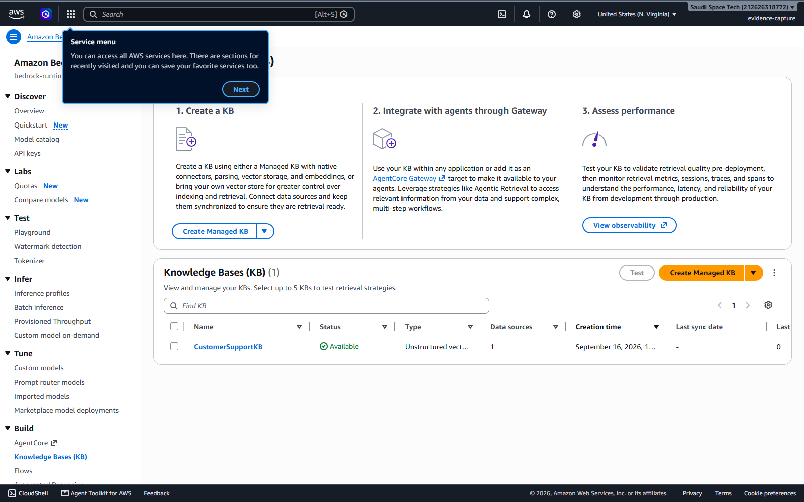](evidence/run-02/screenshots/03-knowledge-base.png)

**Lambda** — both functions behind the Gateway, deployed unmodified from
[`project/starter/lambda/`](project/starter/lambda/)

[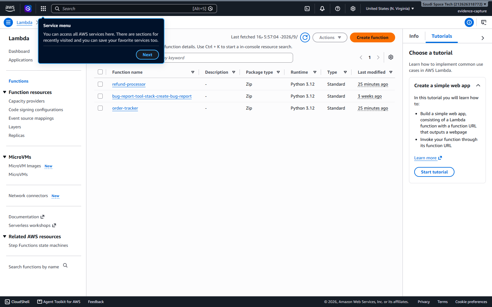](evidence/run-02/screenshots/05-lambda-functions.png)

**API Gateway** — each GET carries the operation name that becomes an MCP tool

[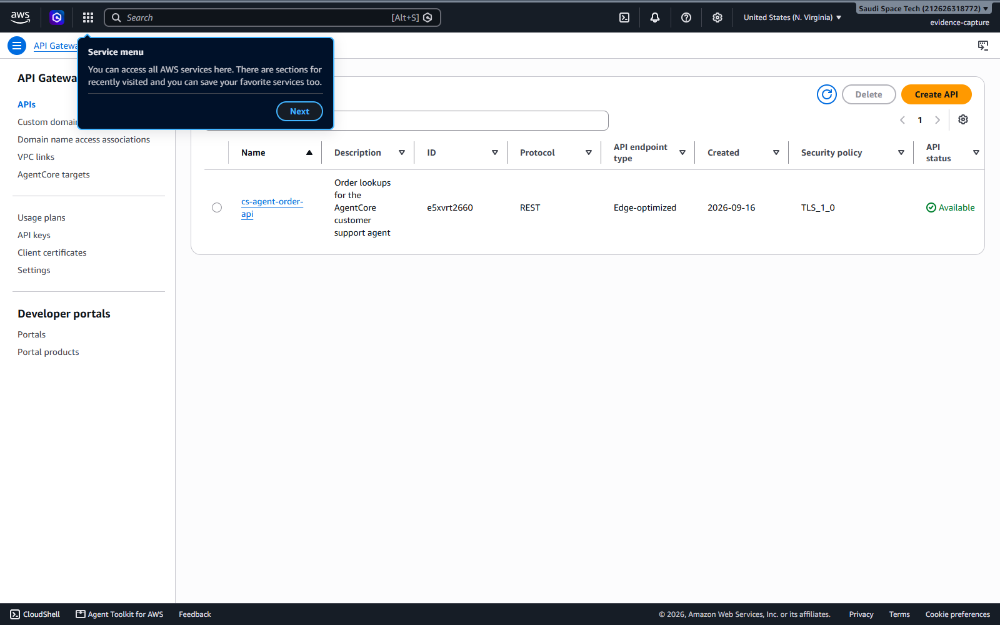](evidence/run-02/screenshots/06-api-gateway-resources.png)

**OpenSearch Serverless** — the vector store behind the Knowledge Base

[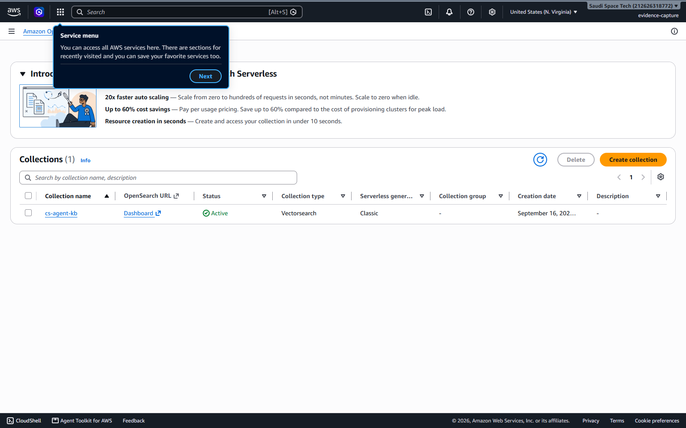](evidence/run-02/screenshots/07-opensearch-collection.png)

**S3** — `product_catalog.txt`, the Knowledge Base source

[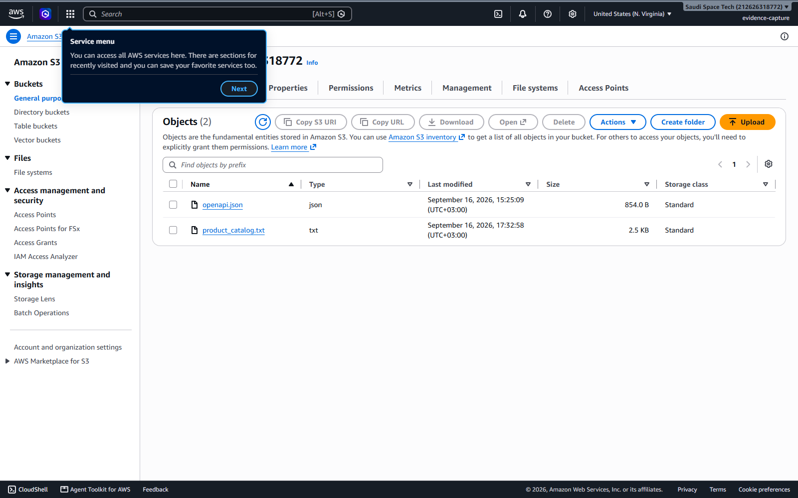](evidence/run-02/screenshots/08-s3-bucket.png)

**CloudWatch** — real `order-tracker` invocations, stronger evidence than a
console test click

[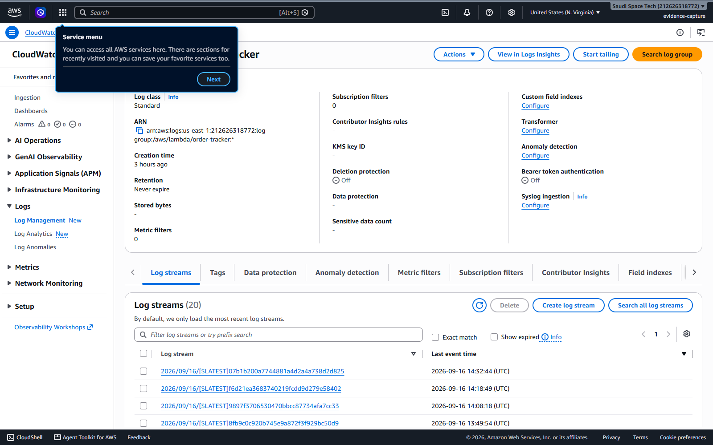](evidence/run-02/screenshots/09-lambda-cloudwatch-logs.png)

Full index: [`evidence/run-02/screenshots/README.md`](evidence/run-02/screenshots/README.md).

---

## Run it yourself in six seconds

No AWS account, no credentials, no network.

```bash
git clone https://github.com/astral-fate/agentic-ai-aws-nanodegree-project-2
cd agentic-ai-aws-nanodegree-project-2

python -m venv venv
source venv/bin/activate          # Windows: venv\Scripts\activate
pip install -r requirements-dev.txt

python -m pytest                  # 99 tests
python -m scripts.run_scenarios   # the six scenarios, writes evidence/run-01/
python -m scripts.render_screenshots
```

### How that is possible

`main.py` imports nine things that only exist inside AWS.
[`harness/fakes.py`](harness/fakes.py) registers stand-ins for all of them in
`sys.modules` before the deliverable is imported, so **the file that gets
deployed is the file that gets tested** — not a copy, not a refactor.

The stand-ins are not uniformly fake, and the differences are the whole story:

| Component | Offline |
|---|---|
| Gateway tools | **real Lambda handler code**, imported from `project/starter/lambda/`; only the transport is faked |
| Code Interpreter | **really executes** the generated program, in a subprocess with no inherited globals |
| Browser | **real HTTP request**, with a clearly-labelled fixture fallback when offline |
| Knowledge Base | real `product_catalog.txt`, term-overlap ranking instead of Titan embeddings |
| Memory | real namespaces and event flow, regex extraction instead of asynchronous LLM strategies |
| **Nova 2 Lite** | **not a model** — a rule-based planner in `harness/scripted_model.py` |

That last row is the one to keep in mind. A green run means every wiring bug
is already fixed, which is exactly what makes the live run worth the AWS
budget: a failure there genuinely means something about the model.

---

## Deploying to AWS

Full walkthrough with troubleshooting: [`docs/RUNBOOK.md`](docs/RUNBOOK.md).

### One command, everything

[`cloudshell/deploy-e2e-v17.sh`](cloudshell/deploy-e2e-v17.sh) is **self-contained** —
every project file is embedded in it, so there is nothing to clone. Open **AWS
CloudShell** in `us-east-1` and paste this one line:

```bash
curl -sSL https://raw.githubusercontent.com/astral-fate/agentic-ai-aws-nanodegree-project-2/main/cloudshell/deploy-e2e-v17.sh -o deploy-e2e-v17.sh && bash deploy-e2e-v17.sh
```

It goes all the way: IAM roles → both Lambdas (with smoke tests) → the REST API
→ S3 → the OpenSearch Serverless collection **and its vector index** → the
Knowledge Base, synced → AgentCore Memory → the Gateway and both targets →
`agentcore configure && deploy` → **all six test scenarios**, each checked
against its expected output and written to a transcript.

```bash
bash deploy-e2e-v17.sh --status      # what exists, change nothing
bash deploy-e2e-v17.sh --test-only   # re-run the six tests
bash deploy-e2e-v17.sh --teardown    # delete everything, OpenSearch first
```

The embedded copies are generated by
[`scripts/build_cloudshell_script.py`](scripts/build_cloudshell_script.py) and
a test asserts the committed script is byte-identical to what the current
sources produce — so the script cannot drift from the repo.

> **It has not been run against a live account.** No credentials with the
> necessary permissions were available here, so every AWS call is written to be
> fallible: a failure prints the exact console steps for that one piece and the
> run continues, and the summary table at the end reports what actually
> succeeded rather than assuming. Treat the first live run as the test.

### Infrastructure only

If you would rather do the Knowledge Base and Gateway by hand:

```bash
bash cloudshell/run-all.sh
```

It creates the IAM role, both Lambdas, the REST API with all three GET
resources wired as proxy integrations and deployed to a stage, the S3 bucket
with the catalog in it, and the AgentCore Memory resource with both
strategies. It smoke-tests the Lambdas both ways — a valid order, and an
unknown one that must **404 rather than return an invented order** — then
writes every ID into `.env`.

It is resumable, and it never deletes working resources. The preflight probes
every required permission read-only and reports all the missing ones at once
before the first write, so credentials scoped to a different project fail in
seconds with a list rather than dying at *"could not create the role"*.

**Deployment status:** attempted on 2026-09-16 and stopped at that preflight.
Nova 2 Lite model access is enabled in the target account, but the available
IAM principals are scoped to an unrelated project and have no Lambda, API
Gateway, S3 or `bedrock-agentcore` permissions. Nothing was created. The run
needs Udacity Cloud Lab credentials, or any principal carrying those
permissions in `us-east-1`.

Three steps stay in the console — the Knowledge Base, the Gateway and its two
targets, and `agentcore configure` / `agentcore deploy` — because creating a
Knowledge Base from the CLI means hand-building an OpenSearch Serverless
collection plus three policies and a vector index first. The script prints
those steps with your values already filled in.

Then:

```bash
cd project/starter
agentcore configure --entrypoint main.py --name customer_support_agent
agentcore deploy
agentcore invoke '{"prompt": "Can you track order ORD-001?", "customer_id": "CUST-123", "session_id": "t1"}'
```

> **Cost.** Under $15 total. Lambda, API Gateway and S3 are effectively free
> at this volume; the Gateway, Memory and the agent cost nothing at rest.
> **OpenSearch Serverless bills by OCU-hour whether or not anything queries
> it** — a project left running over a weekend spends more on an idle vector
> store than on every model call it ever made. Delete the collection *first*
> when tearing down; deleting the Knowledge Base does not take it with you.

---

## Design notes

The decisions worth arguing about are written up in
[`docs/ARCHITECTURE.md`](docs/ARCHITECTURE.md). The short version:

- **Memory is a hook, not a tool.** A `remember_this(fact)` tool is a decision
  the model makes *while* answering — by then it has already concluded it does
  not know the customer's name. `MessageAddedEvent` fires before the model
  sees the message at all, so the context is simply there. And a model that
  forgets to call `remember_this` produces an agent that silently stops
  learning; the `AfterInvocationEvent` hook fires regardless.
- **The refund amount is looked up, never inferred.** The planner calls
  `get_order` before `initiate_refund` specifically so the number comes from
  the order record. A test asserts the ordering, because this is the failure
  that would be invisible in a transcript that otherwise looks fine.
- **Tool results are quoted, not paraphrased.** Especially for RAG —
  paraphrasing lets a retrieval miss hide behind confident prose.
- **The degraded path says it is degraded.** When the Code Interpreter is
  unavailable the fallback computes the tier discount only and returns
  `"fallback": true`. It deliberately does not try to redeem points without
  the sandbox.
- **Two integration styles, one namespace.** The Gateway flattens an API
  Gateway proxy target and a direct Lambda target into the same
  `TargetName___toolName` space. Collisions there are silent — `get_customer`
  is a prefix of `get_customer_orders`, which cost me a debugging session.

---

## What's in here

```
project/starter/
  main.py                  ★ the deliverable — all 8 TODO sections implemented
  main.py.starter            the original starter file, for diffing against main.py
  product_catalog.txt        Knowledge Base source
  lambda/                    deployed as-is: order_tracker, refund_processor, lambda_schema

harness/                   ★ offline stand-ins for the AgentCore + Strands SDKs
  fakes.py                   registers the stand-ins in sys.modules
  gateway.py                 MCP tools over the REAL Lambda handlers
  kb_index.py                retrieval over the real catalog
  memory_store.py            file-backed memory, so two processes share it
  scripted_model.py          the rule-based planner — read this one sceptically

scripts/
  run_scenarios.py         ★ runs the six project tests, writes transcripts
  render_screenshots.py      typesets transcripts as PNGs

tests/                     ★ 99 offline tests
  test_agent_structure.py    entrypoint contract, no placeholders left
  test_knowledge_base_tool.py
  test_memory_hook.py        namespaces, both callbacks, cross-session recall
  test_loyalty_discount.py   12 arithmetic cases, worked by hand
  test_gateway_and_browser.py
  test_scenarios_end_to_end.py

docs/
  ARCHITECTURE.md            how the pieces fit, and why
  RUNBOOK.md                 offline and live, with troubleshooting
  TESTING.md                 what the tests prove — and what they do not
  SECURITY.md                the NONE authorizer, credentials, code injection

cloudshell/
  deploy-e2e-v17.sh            ★ self-contained one-command deploy + all six tests
  run-all.sh                 infrastructure only
evidence/run-01/             transcripts, screenshots, traces, memory state
REFLECTION.md                the 200–400 word reflection
SUBMISSION.md                every rubric line, mapped to code and evidence
```

★ = written for this project. Everything else is the Udacity starter,
unchanged, so the graded files stay byte-identical to what the course ships.

---

## Credits

Starter code and project specification: [Udacity
`cd14763-project-starter`](https://github.com/udacity/cd14763-project-starter).
`project/starter/lambda/` and `product_catalog.txt` are unmodified from it.
